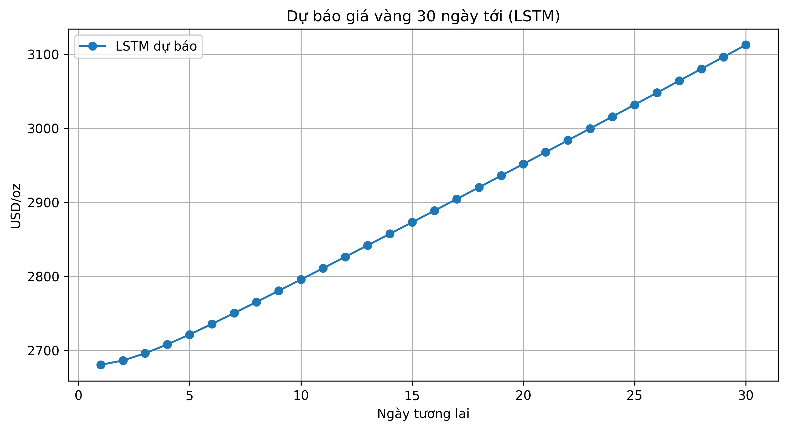

# 📈 DỰ BÁO GIÁ VÀNG BẰNG LSTM & XGBOOST

## Tác giả
**Phạm Đức Thành**  
Sinh viên ngành Công nghệ Thông tin   

---

## Giới thiệu đề tài
Giá vàng là một trong những chỉ số tài chính quan trọng, chịu ảnh hưởng bởi nhiều yếu tố kinh tế – chính trị toàn cầu.  
Đề tài này tập trung vào việc **xây dựng mô hình học máy và học sâu** nhằm:
- Phân tích xu hướng giá vàng trong quá khứ
- Dự báo giá vàng trong **30 ngày tương lai**
- So sánh hiệu quả giữa **LSTM** và **XGBoost**

---

## Mục tiêu nghiên cứu
- Thu thập và tiền xử lý dữ liệu giá vàng lịch sử
- Xây dựng mô hình **LSTM (Long Short-Term Memory)** cho chuỗi thời gian
- Xây dựng mô hình **XGBoost** làm đối chứng
- Đánh giá mô hình bằng các chỉ số RMSE, MAE
- Trực quan hóa kết quả dự báo

---

## Cấu trúc thư mục
gold-price-forecast-lstm/
│
├── gold_price_lstm.ipynb # Notebook huấn luyện & dự báo
├── README.md # Mô tả dự án
├── images/
│ └── du_bao_gia_vang_30_ngay_LSTM.png

---

## Dữ liệu
- **Nguồn dữ liệu**: Giá vàng thế giới (USD/oz)
- **Đặc trưng sử dụng**: Giá đóng cửa (Close price)
- **Dạng dữ liệu**: Chuỗi thời gian (Time Series)

---

## Mô hình sử dụng

### LSTM (Long Short-Term Memory)
- Phù hợp với dữ liệu chuỗi thời gian
- Có khả năng ghi nhớ thông tin dài hạn
- Được sử dụng để dự báo giá vàng 30 ngày tiếp theo

### XGBoost
- Mô hình cây quyết định tăng cường
- Được dùng để so sánh hiệu quả với LSTM

---

## Kết quả dự báo

### Dự báo giá vàng 30 ngày tới (LSTM)

Biểu đồ cho thấy xu hướng giá vàng trong 30 ngày tiếp theo theo mô hình LSTM, phản ánh sự kế thừa xu hướng từ dữ liệu lịch sử.

---

##  Đánh giá mô hình
Các chỉ số được sử dụng:
- **RMSE (Root Mean Squared Error)**
- **MAE (Mean Absolute Error)**

Kết quả cho thấy mô hình LSTM có khả năng dự báo ổn định và phù hợp với bài toán chuỗi thời gian.

---

## Công nghệ sử dụng
- Python
- NumPy, Pandas
- Matplotlib
- Scikit-learn
- TensorFlow / Keras
- XGBoost
- Google Colab
  
---

## Kết luận
Đề tài đã xây dựng thành công mô hình dự báo giá vàng dựa trên học sâu và học máy.  
Trong tương lai, có thể mở rộng:
- Bổ sung thêm các biến kinh tế vĩ mô
- Dự báo dài hạn hơn
- Triển khai dashboard trực quan (Streamlit)
  
---

## Tài liệu tham khảo
- Brownlee, J. (2018). *Deep Learning for Time Series Forecasting*
- Documentation TensorFlow & XGBoost
- Các nguồn dữ liệu tài chính công khai
